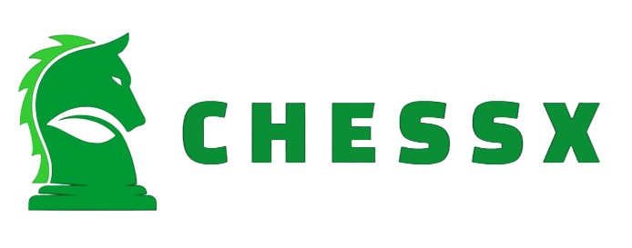

## The Web Application to play multiplayer chess game.

#### FrontEnd -> ReactJs

#### Backend -> Nestjs + socket.io

#### GameEngine-> chess.js + stockfish for bot gameplay

## Setup App Locally

To use Stockfish Bot service
you will have to install stockfish locally on the system and steup env variable for stockfish to run then only stockfish api wil work or

use second method to setup app using dokcer-compose

```
# Install dependencies
npm install

# Run in devlopement mode
# React App htttp://localhost:5173
# Nest Bakcned API http://localhost:5000
# Stockfish API http://localhost:5123

npm run dev


# Run production

npm run start   // access app on http://localhost:3000


```

## Setup using Docker container

```
docker-compose up --build
```

### Access the app on http://localhost:80


#### In this method you dont have to install stockfish locally as i have created service for that in docker-compose file.


